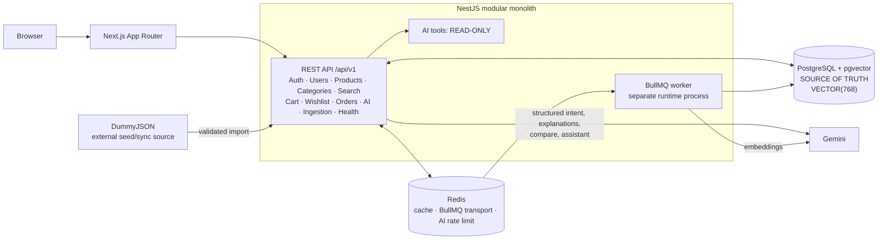

# ShopMind

ShopMind is an AI-powered product discovery and shopping assistant. It turns a
natural-language need into validated intent, deterministic constraints,
keyword and semantic retrieval, deterministic ranking, and a grounded
explanation.

The LLM does not own product truth. Product titles, prices, ratings, stock, and
availability shown to users are mapped from canonical backend data in
PostgreSQL.

> Deployment status: the production container foundation is available, but no
> public hosting platform, managed database/cache, domain, or public demo URL
> is configured yet.

## Contents

- [MVP scope](#mvp-scope)
- [Architecture](#architecture)
- [Technology](#technology)
- [Repository layout](#repository-layout)
- [Local setup](#local-setup)
- [Product import](#product-import)
- [Development commands](#development-commands)
- [Testing](#testing)
- [Deployment](#deployment)
- [Demo script](#1-2-minute-demo-script)
- [Safety and trade-offs](#safety-and-trade-offs)

## MVP scope

Implemented capabilities include:

- register, login, rotating refresh sessions, and logout;
- PostgreSQL-backed catalog, categories, product details, filters, sorting,
  pagination, and keyword search;
- cart, wishlist, simulated checkout, and immutable order snapshots;
- pgvector semantic retrieval and deterministic hybrid ranking;
- Gemini-backed structured intent, grounded AI search, compare, and a
  read-only shopping assistant;
- validated DummyJSON ingestion and BullMQ embedding jobs;
- Redis catalog caching, queue transport, and AI rate limiting;
- structured/redacted logging, health checks, CI, Jest/Supertest integration
  coverage, Playwright E2E, and offline AI evaluation.

MVP non-goals are real payment, logistics, multi-seller behavior, custom
recommendation ML, and microservices. Provider fallback, personalization,
review summarization, multimodal search, and SSE streaming remain outside the
current scope.

## Architecture

ShopMind is a `pnpm` monorepo. The NestJS backend is a modular monolith with
the dependency direction `Controller -> Application Service -> Repository /
Provider`. The HTTP API and BullMQ worker are separate runtime processes from
the same backend codebase, not microservices.



PostgreSQL is the canonical source of truth. DummyJSON data flows through the
ingestion module for validation, normalization, and upsert; the browser never
uses DummyJSON as its canonical catalog API. Redis is operational
infrastructure, and catalog reads fall back to PostgreSQL when its cache is
unavailable.

Hybrid ranking applies hard constraints before scoring candidates:

```text
0.45 semantic + 0.20 keyword + 0.15 preference + 0.10 rating + 0.10 stock
```

## Technology

| Area | Stack |
| --- | --- |
| Web | Next.js App Router, React, TypeScript, Tailwind CSS, shadcn/ui |
| Web state/forms | TanStack Query, React Hook Form, Zod |
| API | NestJS, TypeScript, class-validator, Swagger/OpenAPI |
| Data | Prisma, PostgreSQL, pgvector `VECTOR(768)` |
| Async/cache | Redis, BullMQ |
| AI | Gemini generation/function calling and Gemini embeddings |
| Quality | Jest, Supertest, Playwright, offline grounding evaluation |
| Tooling | pnpm workspace, Turborepo, Docker Compose, GitHub Actions |

## Repository layout

```text
shopmind/
├── apps/
│   ├── web/                 # Next.js application
│   └── api/                 # NestJS API and worker entrypoints
├── packages/
│   ├── contracts/           # framework-agnostic public contracts
│   ├── eslint-config/
│   └── tsconfig/
├── prisma/                  # schema and committed migrations
├── scripts/                 # repository operational scripts
├── docs/                    # normative technical specification
├── docker-compose.yml       # local PostgreSQL/pgvector and Redis
├── pnpm-workspace.yaml
└── turbo.json
```

## Local setup

### Prerequisites

- Node.js `24.15.0`;
- pnpm `10.15.0` through Corepack;
- Docker with Docker Compose v2;
- a Gemini API key for AI generation and embedding functionality.

Run commands from the repository root.

### 1. Install dependencies

```bash
corepack enable
corepack pnpm install --frozen-lockfile
```

### 2. Configure the environment

Copy `.env.example` to a root `.env`, then replace the documented secret
placeholders with local development values.

```bash
cp .env.example .env
```

| Category | Variables |
| --- | --- |
| Data | `DATABASE_URL`, `REDIS_URL` |
| Auth | `JWT_ACCESS_SECRET`, `JWT_ACCESS_TTL`, `REFRESH_TOKEN_TTL_DAYS`, `COOKIE_SECURE` |
| Import | `DUMMYJSON_BASE_URL` |
| Gemini | `GEMINI_API_KEY`, `GEMINI_MODEL`, `GEMINI_EMBEDDING_MODEL`, `GEMINI_EMBEDDING_DIMENSION` |
| AI runtime | `AI_TIMEOUT_MS`, `AI_MAX_TOOL_STEPS` |
| Applications | `API_PORT`, `WEB_ORIGIN`, `SHOPMIND_API_BASE_URL`, `NODE_ENV` |

Real `.env` files must not be committed. Server secrets must never use a
`NEXT_PUBLIC_` prefix. The embedding dimension is fixed at `768`; startup
validation rejects a mismatch. Production also rejects missing secrets,
insecure cookies, and a non-public/non-HTTPS web origin.

### 3. Start PostgreSQL and Redis

Compose runs only the local infrastructure dependencies, not the applications:

```bash
docker compose up -d postgres redis
docker compose ps
```

Do not use `docker compose down -v` as a routine command because it deletes the
PostgreSQL volume.

To run the complete isolated development stack (database, Redis, migrations,
catalog bootstrap, API, worker, and web), use:

```bash
docker compose -f docker-compose.dev.yml up -d --build
docker compose -f docker-compose.dev.yml ps
```

The one-shot `bootstrap-catalog` service imports DummyJSON only when the
canonical product table is empty. Subsequent starts keep serving PostgreSQL
data and do not require DummyJSON to be available. Override the optional
`DEV_*_PORT` values in `.env` when a host port is already occupied.

### 4. Generate Prisma Client and apply committed migrations

```bash
corepack pnpm --filter api prisma:generate
corepack pnpm --filter api prisma:migrate:deploy
```

Use `prisma:migrate:dev` only when intentionally authoring a new development
migration. Production releases use `prisma:migrate:deploy` once before the API
and worker receive traffic.

### 5. Start the applications

The worker is separate from the web/API development processes.

```bash
# Terminal 1
corepack pnpm --filter api worker:dev

# Terminal 2: starts web and API through the workspace dev task
corepack pnpm dev
```

If the local Corepack shim is not visible to Turborepo, start the same two app
tasks explicitly in separate terminals:

```bash
corepack pnpm --filter api dev
corepack pnpm --filter web dev
```

Verify:

```text
Web:            http://localhost:3000
API health:     http://localhost:4000/api/v1/health
Swagger (dev):  http://localhost:4000/docs
```

Swagger is disabled when `NODE_ENV=production`.

## Product import

For a host-based setup, bootstrap or recover the catalog through the internal CLI:

```bash
corepack pnpm --filter api catalog:bootstrap
```

This command uses the same validation, normalization, canonical upsert, cache
invalidation, and embedding enqueue pipeline as normal ingestion. It explicitly
runs a full idempotent sync, even when products already exist, so re-running it
can recover an interrupted import. It exits non-zero on failure. The compiled
production command is `node apps/api/dist/catalog-bootstrap.js`.

Only the automatic development Compose bootstrap passes `--if-empty` to skip
when products already exist. Do not use that option for partial-import recovery.
Categories are upserted once per slug, then each product and its images/reviews
commit in a short transaction. Source absence is marked only after all products
persist, and embedding jobs are enqueued after persistence has committed.

Recurring/manual product synchronization remains queue-backed, so Redis, the
worker, and API must be running. The protected trigger is:

```http
POST /api/v1/admin/ingestion/products
Authorization: Bearer <ADMIN_ACCESS_TOKEN>
```

Example after obtaining a securely provisioned ADMIN access token:

```bash
curl -X POST http://localhost:4000/api/v1/admin/ingestion/products \
  -H "Authorization: Bearer <ADMIN_ACCESS_TOKEN>"
```

Public registration always creates a normal `USER`. After that user exists, an
operator with server/container access can grant the ADMIN role without a
default password or direct SQL:

```bash
corepack pnpm --filter api admin:grant -- --email operator@example.com
```

For the full-stack Compose environment, run the compiled command inside the
API container:

```bash
docker compose -f docker-compose.dev.yml exec api \
  node apps/api/dist/admin-provision.js --email operator@example.com
```

The operation is idempotent and logs only the user ID and outcome. The user
must sign in again to receive a new access token containing the ADMIN role.

The implemented pipeline is `DummyJSON -> Zod validation -> normalization ->
canonical upsert -> content_hash comparison -> BullMQ embedding job`. The
worker reloads canonical product data, validates a finite 768-dimensional
embedding, and upserts it into PostgreSQL.

## Development commands

| Command | Purpose |
| --- | --- |
| `corepack pnpm dev` | Start package `dev` tasks (web and API; not worker) |
| `corepack pnpm --filter api worker:dev` | Start the BullMQ worker in watch mode |
| `corepack pnpm --filter api catalog:bootstrap` | Full idempotent DummyJSON sync, including partial-import recovery |
| `corepack pnpm --filter api admin:grant -- --email <email>` | Grant ADMIN to an existing user |
| `corepack pnpm --filter api build` | Build API and worker entrypoints |
| `corepack pnpm --filter api start:prod` | Run the compiled API |
| `corepack pnpm --filter api worker:start` | Run the compiled worker |
| `corepack pnpm --filter web build` | Build the production Next.js app |

## Testing

PostgreSQL/pgvector and Redis must be healthy for integration/API E2E tests.
The normal CI suite uses service containers and mocked provider boundaries; it
does not require a live Gemini or DummyJSON call.

```bash
corepack pnpm lint
corepack pnpm typecheck
corepack pnpm test
corepack pnpm test:integration
corepack pnpm --filter api test:contract
corepack pnpm --filter api test:e2e
corepack pnpm --filter api test:evaluation
corepack pnpm --filter api test:performance
corepack pnpm --filter web test:e2e
corepack pnpm build
```

`test:evaluation` is an offline grounding evaluation. It checks candidate-ID
grounding and recommendation quality against curated deterministic fixtures;
it does not call Gemini.

## Deployment

Production deployment is pending: there is no selected hosting provider,
managed PostgreSQL/Redis service, domain, or public URL in this repository.
Do not treat localhost addresses as a live demo.

The platform-neutral backend image is built from the repository root:

```bash
docker build -f apps/api/Dockerfile -t shopmind-api .
```

The same image runs two independent processes:

```text
API:     node apps/api/dist/main.js
Worker:  node apps/api/dist/worker.js
```

The intended production topology requires managed PostgreSQL with pgvector,
managed Redis/Valkey, runtime-injected secrets, a separate API and worker
service, and a web/API origin strategy compatible with the Secure HttpOnly
`SameSite=Lax` refresh cookie. CI builds the production backend image, but no
provider-specific deploy job is configured. Deployment must remain gated on a
successful `main` CI run.

## 1-2 minute demo script

Preconditions: catalog import is complete, embeddings are current, and the
presenter is signed in as a normal USER created through `/register`. No demo
credentials or privileged account are committed.

1. Open `/products`; browse a category, adjust a filter, and point out that
   filter state remains in the URL.
2. Open `/search/ai` and submit exactly: `laptop for backend development under
   $1200, Docker, 16GB RAM`.
3. Show the validated parsed intent, then explain that the backend—not Gemini—
   applies hard filters, keyword/semantic retrieval, and deterministic ranking.
4. Show reasons and trade-offs. If `16GB RAM` cannot be verified from canonical
   product data, call out the honest no-hard-match/fallback state.
5. Select three returned products and open `/compare`; identify the canonical
   comparison table separately from the grounded AI summary.
6. Add a product to wishlist and cart through the normal UI, run the simulated
   checkout, and open `/orders` to show the created immutable snapshots.

The assistant may recommend and read product/user context, but it cannot
perform any of the wishlist, cart, checkout, or order mutations in this flow.
AI timeout states provide retry/deterministic fallback instead of fabricated
product facts.

## Safety and trade-offs

- AI tools are read-only: they cannot mutate cart/wishlist, checkout, create
  orders, change price/stock, delete data, or perform payment.
- Model-selected product IDs are checked against server candidate/tool
  allowlists before canonical product facts are projected into responses.
- Access JWTs are short-lived; refresh credentials are hashed server-side,
  rotated, and stored in HttpOnly cookies (`Secure` in production).
- Vector SQL is parameterized and isolated in a repository boundary. HNSW is
  intentionally deferred for the small MVP dataset; trigram indexing is used
  for keyword matching.
- DummyJSON is a small, inconsistent external dataset behind a replaceable
  ingestion adapter; it is not runtime catalog truth.
- Gemini availability/quota can affect AI and embedding operations. Keyword
  catalog search remains deterministic, while embedding jobs retain bounded
  retries and observable failures.
- Redis cache loss must not take down catalog reads, but queue processing and
  Redis-backed rate limiting require Redis availability.
- The modular monolith reduces MVP operational complexity while preserving
  domain module boundaries.

## Further reading

- [Architecture and monorepo](docs/01-architecture-and-monorepo.md)
- [Database and migrations](docs/02-database-and-migrations.md)
- [Backend API and contracts](docs/03-backend-api-and-contracts.md)
- [AI subsystem and prompts](docs/04-ai-subsystem-and-prompts.md)
- [Frontend routes and states](docs/05-frontend-routes-and-states.md)
- [Ingestion and workers](docs/06-ingestion-and-workers.md)
- [Project phases and task list](docs/07-project-phases-and-task-list.md)
- [Worker recovery runbook](docs/08-worker-recovery-runbook.md)
